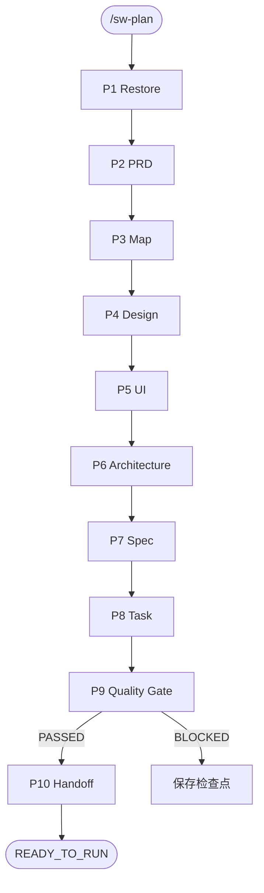

# SweetWave 自治文档编排

请求规划范围：

```txt
$ARGUMENTS
```

## 定位

`/sw-plan` 是 SweetWave 文档阶段的自治编排器和规划状态唯一写入者。默认从
Idea/Brief 生成 PRD，连续推进到可由 `/sw-run` 执行的任务清单。

只有 `/sw-plan` 可以推进：

```txt
.wave/PLAN_STATE.md
.wave/STATUS.md 中的文档阶段状态
.wave/MODULE_MAP.md 中的文档状态列
```

Document Engineer Skills 只创建或更新各自目标产物，不得写规划状态。

## 参数

```txt
/sw-plan
/sw-plan {scope}
/sw-plan --all
/sw-plan --resume
/sw-plan --from map
/sw-plan --module product-detail
/sw-plan --stage prd|map|design|ui|architecture|spec|task|quality
/sw-plan --change {scope} 变更说明
```

- 无参数：使用 `INIT` scope，从 PRD 连续推进到 P10。
- `{scope}`：使用对应 `{SCOPE}-IDEA/BRIEF/PRD`。
- `--all`：处理 MODULE_MAP 中所有 planned/active/stale 模块。
- `--resume`：恢复 PLAN_STATE 中的活动检查点。
- `--from`：从指定阶段开始，并连续推进后续节点。
- `--module`：只处理指定模块；PRD/Map 仍使用当前 scope 的全局产物。
- `--stage`：执行 P1 后只推进目标阶段及必要状态写回。
- `--change`：分析上游变化、传播 STALE；涉及已完成任务或代码时暂停确认。

## 状态模型

```txt
MISSING → DRAFT → REVIEWING → READY
                     ↓
                  BLOCKED

READY + 上游变化 → STALE
```

规划检查点状态：

```txt
IDLE / RUNNING / PAUSED / BLOCKED / COMPLETED
```

## 节点拓扑



## 节点加载

到达节点时只读取对应 reference：

| 节点 | Reference |
|---|---|
| P1 | `references/P1-restore.md` |
| P2 | `references/P2-prd.md` |
| P3 | `references/P3-map.md` |
| P4 | `references/P4-design.md` |
| P5 | `references/P5-ui.md` |
| P6 | `references/P6-architecture.md` |
| P7 | `references/P7-spec.md` |
| P8 | `references/P8-task.md` |
| P9 | `references/P9-quality-gate.md` |
| P10 | `references/P10-handoff.md` |

## 全局规则

- PRD 和 Map 串行；模块阶段按依赖与优先级串行执行。
- 第一版只识别模块并行候选，不执行并行写入。
- Role Skill 可以写目标产物，但不得写 PLAN_STATE、STATUS 或 RUN_STATE。
- RUN_STATE 存在活动工程现场时，不启动或恢复文档改造，先处理当前工程检查点。
- 更新已有文档时保留人工内容、已确认决策和状态字段。
- 上游变化先做影响分析；涉及 `[x]` 任务或已有代码时暂停确认。
- 质量门通过前不得写 `READY_TO_RUN`。
- 不自动提交、部署、发布或调用 `/sw-run`。
- 只使用 `.wave/*` 作为 SweetWave 工作区。
- 输出语言使用中文。
