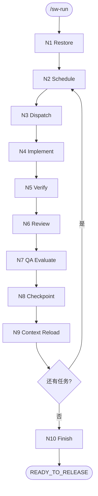

# SweetWave 自治工程编排

请求执行范围：

```txt
$ARGUMENTS
```

## 定位

`/sw-run` 是 SweetWave 唯一的运行期状态写入者和自治编排入口。它调用 Engineer Skills
完成专业工作，并负责把结果推进到下一质量门。

除 `/sw-init` 初始化文件、`/sw-task` 创建任务定义外，只有 `/sw-run` 可以修改：

```txt
.wave/STATUS.md
.wave/RUN_STATE.md
.wave/specs/{module}/TASKS.md
```

Engineer Skills、`/sw-work`、`/sw-verify`、`/sw-review` 不得修改以上文件。

`/sw-run` 只接受 `/sw-plan` P10 已交接的物料：`STATUS.md` 必须为
`READY_TO_RUN`，且 `.wave/PLAN_REPORT.md` 必须为 `PASSED`。

## 参数

```txt
/sw-run
/sw-run {module}
/sw-run {module} TASK-001
/sw-run TASK-001
/sw-run --all
/sw-run {module} --all
/sw-run --stage scaffold
/sw-run {module} TASK-001 --stage implement
/sw-run {module} TASK-001 --stage verify
/sw-run {module} TASK-001 --stage review
/sw-run {module} TASK-001 --stage qa
```

- 无 `--stage`：从有效检查点开始，执行完整流水线；存在未完成的条件强制骨架时拒绝启动。
- `/sw-run`：选择全项目下一个可执行任务，完成该任务后停止。
- `/sw-run {module}`：选择指定模块下一个可执行任务，完成该任务后停止。
- `/sw-run TASK-ID` 或 `/sw-run {module} TASK-ID`：只执行唯一匹配的指定任务，完成后停止。
- `/sw-run {module} --all`：串行完成指定模块内全部可执行任务，模块完成后停止，
  不进入其他模块。
- `/sw-run --all`：串行完成全项目全部可执行任务；只有该模式在任务清空后进入 N10。
- `scaffold`：只执行唯一的 `app-shell/APP-SHELL-001` 完整流水线，完成后停止并
  等待用户检查页面骨架。
- `implement`：只推进实现阶段，结束时停在 `[VERIFYING]`。
- `verify`：只推进验证阶段，结束时停在 `[REVIEWING]` 或 `[BLOCKED]`。
- `review`：只推进审查阶段；如无需额外门禁则完成任务，否则停在 QA 阶段。
- `qa`：只推进 QA 和安全专项门禁，通过后完成任务。
- 指定阶段与当前生命周期不兼容时暂停，并给出正确恢复命令。

## 三层状态

- `STATUS.md`：项目阶段、模块进度、物料清单、QA 累积和下一步。
- `TASKS.md`：任务生命周期和执行元数据。
- `RUN_STATE.md`：当前节点、调度计划、执行结果、Git 基线和恢复摘要。

生命周期：

```txt
[ ] / [NEW] / [CHANGED]
→ [IN_PROGRESS]
→ [VERIFYING]
→ [REVIEWING]
→ QA / Security（按需）
→ [x]
```

`[BLOCKED]` 可从任何活动阶段进入；`[DROPPED]` 和 `[x]` 跳过。

## 节点拓扑



## 节点加载

到达节点时读取对应 reference，不提前加载其他节点：

| 节点 | Reference |
|---|---|
| N1 | `references/N1-restore.md` |
| N2 | `references/N2-schedule.md` |
| N3 | `references/N3-dispatch.md` |
| N4 | `references/N4-implement.md` |
| N5 | `references/N5-verify.md` |
| N6 | `references/N6-review.md` |
| N7 | `references/N7-qa-evaluate.md` |
| N8 | `references/N8-checkpoint.md` |
| N9 | `references/N9-context-reload.md` |
| N10 | `references/N10-finish.md` |

阶段模式从对应节点进入，但必须先执行 N1；完成该节点要求的状态写回后停止。
`scaffold` 是例外：它从 N1 或当前有效生命周期检查点继续，执行至 N8 的完整受限
流水线，在骨架检查点结束。

## 执行范围

N1 必须将本次调用归一化为以下一种范围，并写入 `RUN_STATE.md`：

| 范围模式 | 目标 | N8 后行为 | 停止条件 |
|---|---|---|---|
| `NEXT_PROJECT_TASK` | 全项目 | N9 后停止 | 一个任务完成 |
| `NEXT_MODULE_TASK` | 指定模块 | N9 后停止 | 模块内一个任务完成 |
| `SINGLE_TASK` | 唯一 module + TASK-ID | N9 后停止 | 指定任务完成 |
| `ALL_MODULE_TASKS` | 指定模块 | 范围内仍有任务则返回 N2 | 指定模块任务完成 |
| `ALL_PROJECT_TASKS` | 全项目 | 全项目仍有任务则返回 N2，否则进入 N10 | 全项目任务完成 |
| `SCAFFOLD_ONLY` | `app-shell/APP-SHELL-001` | N8 后停止 | 骨架任务完成 |

- “还有任务”必须解释为“当前执行范围内还有任务”，不得从模块范围越界到其他模块。
- 单任务和 next-task 模式即使完成了模块或项目最后一个任务，也只结束本次范围；
  不自动升级为 `--all`，不进入 N10。
- 活动检查点恢复时沿用落盘的范围模式和目标。用户显式提供不同范围时先暂停确认。
- 阶段模式继承当前任务范围；没有活动检查点时必须明确指定可唯一定位的任务。

## 全局规则

- 默认串行执行。第一版只识别并行候选，不派发并行修改。
- 前端骨架是条件强制门；状态为 PENDING、BLOCKED 或 STALE 时不得调度普通任务。
- Engineer Skill 只返回结构化结果；`/sw-run` 验证结果后再写状态。
- 非 `generic` 任务必须通过 `Skill` 工具调用 N3 选中的 Engineer Skill；
  `/sw-run` 不得在 N4 代替该角色修改业务代码。
- `Skill` 工具调用是在当前 `/sw-run` 调用内加载并执行专业流程，不是独立子进程。
  Engineer 的“执行结果”是内部交接数据，不是面向用户的最终答复；结果生成后必须
  立即恢复 `/sw-run` 对应节点。
- `disable-model-invocation: false` 是内部 Engineer Skills 的调用契约；如果目标 Skill
  不可调用、调用失败或没有返回结构化结果，任务必须阻塞，不得降级为 `generic`。
- 从 N4 或更晚节点恢复非 `generic` 任务时，必须存在已验证的派发凭证；
  缺失时先退回 N3，禁止凭聊天记忆直接继续实现。
- `ALL_MODULE_TASKS` 和 `ALL_PROJECT_TASKS` 是持续批量调用。单个 Engineer 完成、
  单个任务写入 `[x]`、上下文摘要落盘都不是终止条件；只有 N9 判定当前范围完成、
  阻塞或需要用户确认时才允许向用户输出最终答复。
- QA 和安全门禁在 `[x]` 之前执行。
- 物料过期、Git 现场冲突、业务歧义、高风险破坏性变更必须暂停。
- 暂停时保存精确恢复命令、已完成步骤、修改文件和阻塞原因。
- 不依赖聊天历史恢复；磁盘状态和 Git 现场是唯一依据。
- 不自动提交、不自动部署、不自动发布。
- 只使用 `.wave/*` 作为 SweetWave 工作区。
- 输出语言使用中文。
