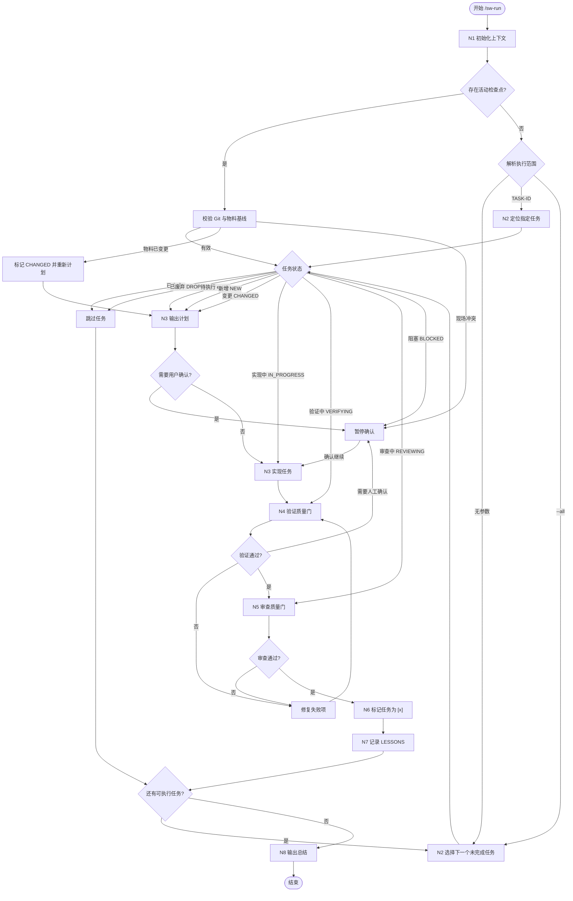

# SweetWave 状态机执行

请求执行范围：

```txt
$ARGUMENTS
```

## 定位

`/sw-run` 是 SweetWave 的可选编排入口。它不替代 `/sw-work`、`/sw-verify`、`/sw-review`，而是把这些分阶段命令串成一个可恢复的任务状态机。

适用场景：

- 用户希望连续执行多个任务。
- 需要从 `TASKS.md` 的状态断点恢复。
- 希望每个任务都强制经过实现、验证、审查、标记完成和经验沉淀。

## 必读输入

读取：

- `CLAUDE.md`
- `.wave/MODULE_MAP.md`
- `.wave/STATUS.md`
- `.wave/RUN_STATE.md`
- `.wave/specs/{module}/MODULE.md`
- `.wave/specs/{module}/DESIGN.md`
- `.wave/specs/{module}/UI.md`
- `.wave/specs/{module}/ARCH.md`
- `.wave/specs/{module}/SPEC.md`
- `.wave/specs/{module}/TASKS.md`
- `.wave/specs/{module}/TEST_REPORT.md`，如果存在
- `.wave/LESSONS.md`，如果存在

## 状态标记

`TASKS.md` 是任务生命周期状态源。必须识别以下状态：

```md
- [ ] 待执行
- [IN_PROGRESS] 正在实现
- [VERIFYING] 正在验证
- [REVIEWING] 正在审查
- [BLOCKED] 存在阻塞
- [x] 已完成
- [NEW] 新增任务
- [CHANGED] 变更后的任务
- [DROPPED] 已废弃任务
```

处理规则：

- `[x]`：跳过。
- `[DROPPED]`：跳过。
- `[IN_PROGRESS]`：读取 `RUN_STATE.md`，从实现阶段恢复。
- `[VERIFYING]`：读取已有修改和验证记录，从验证质量门恢复。
- `[REVIEWING]`：确认验证报告仍有效，从审查质量门恢复。
- `[BLOCKED]`：报告阻塞原因；问题已解除时从检查点指定阶段恢复。
- `[CHANGED]`：按当前任务描述执行。
- `[NEW]`：按新增任务执行。
- `[ ]`：正常执行。

## 三层记忆

- `.wave/STATUS.md`：项目级快照，包括工作流阶段、模块进度、物料清单和下一步。
- `.wave/specs/{module}/TASKS.md`：任务生命周期状态。
- `.wave/RUN_STATE.md`：当前唯一执行现场，包括任务阶段、基准提交、物料基线、
  已修改文件、验证结果、阻塞原因和恢复命令。

## 启动与恢复协议

每次启动 `/sw-run` 必须先执行：

1. 读取 `CLAUDE.md`、`.wave/LESSONS.md`、`.wave/STATUS.md` 和
   `.wave/RUN_STATE.md`。
2. 检查当前 Git commit、工作区状态和 `RUN_STATE.md` 的基准提交。
3. 重新计算当前任务 `MODULE.md`、`DESIGN.md`、`UI.md`、`ARCH.md`、`SPEC.md`、
   `TASKS.md` 的指纹，并与检查点物料基线比较。`TASKS.md` 比较时忽略生命周期
   状态标记，只比较任务定义和验收内容。
4. 如果存在 `RUNNING`、`PAUSED` 或 `BLOCKED` 检查点，优先恢复该任务；
   显式指定其他任务时，先提示当前现场并要求确认切换。
5. 物料未变化且 Git 现场可解释时，从记录阶段恢复。
6. `SPEC.md`、`ARCH.md` 或任务定义发生变化时，将任务标记为 `[CHANGED]`，
   清除过期验证结论并回到 `PLANNING`。
7. 工作区存在无法归属当前任务的改动时暂停，不得覆盖或擅自吸收。
8. 没有活动检查点时，才根据参数和依赖选择新任务。

## 状态机



## 工作流程

1. 执行“启动与恢复协议”，活动检查点优先于新任务选择。
2. 没有活动检查点时解析执行范围：
   - 无参数：执行所有模块中的下一个未完成任务。
   - `{module}`：执行指定模块中的下一个未完成任务。
   - `{module} TASK-ID`：只执行指定模块的指定任务。
   - `TASK-ID`：遍历 `.wave/specs/*/TASKS.md` 查找唯一匹配任务。
   - `--all`：按依赖顺序连续执行所有模块的所有未完成任务。
   - `{module} --all`：按依赖顺序连续执行指定模块的所有未完成任务。
3. 读取 `.wave/specs/{module}/TASKS.md`，按生命周期状态分流。
4. 分析依赖关系：
   - 有显式依赖、同文件或同模块改动，串行执行。
   - 无依赖且修改范围隔离，可建议并行，但默认仍以串行为主，除非用户明确授权并行。
5. 对新任务执行等价于 `/sw-work TASK-ID` 的流程：
   - 定位任务。
   - 提取目标、允许修改范围、禁止修改范围、验收标准、验证命令。
   - 先输出实现计划。
   - 如果需要用户确认，将 `RUN_STATE.md` 写为 `PAUSED / PLANNING`，记录计划摘要、
     物料基线和恢复命令；任务状态暂时保持原值。
   - 获得用户批准或已有明确授权后，将任务写为 `[IN_PROGRESS]`。
   - 创建或更新 `RUN_STATE.md`：状态 `RUNNING`、阶段 `IMPLEMENTING`，记录
     基准提交、物料指纹和恢复命令。
   - 实现过程中持续维护已完成步骤和已修改文件。
   - 实现完成后将任务写为 `[VERIFYING]`，检查点阶段写为 `VERIFYING`。
6. 验证质量门：
   - 执行任务内列出的验证命令。
   - 选择最小相关的 typecheck / lint / test / build。
   - 更新 `.wave/specs/{module}/TEST_REPORT.md`。
   - 每次命令及结果写入 `RUN_STATE.md`。
   - 失败且可在原范围修复时保持 `[VERIFYING]` 并修复后重跑。
   - 失败且需要扩大范围时写为 `[BLOCKED]`，检查点状态写为 `BLOCKED`。
   - 验证通过后将任务写为 `[REVIEWING]`，检查点阶段写为 `REVIEWING`。
7. 审查质量门：
   - 审查当前任务相关 diff。
   - 检查 correctness、架构边界、测试缺口、安全风险、无关改动。
   - Must Fix 未解决前不得标记完成；需要暂停时写为 `[BLOCKED]`。
8. 标记完成：
   - 用 Edit / MultiEdit 将当前任务状态改为 `[x]`。
   - 只修改任务状态，不重写任务描述。
   - 修改后重新读取 `TASKS.md`，确认状态已写入。
   - 将 `RUN_STATE.md` 状态写为 `COMPLETED`、阶段写为 `FINALIZING`，保存最终证据。
   - 更新 `STATUS.md` 的模块计数、当前任务和下一步命令。
   - 如果所有可执行任务完成，将工作流阶段写为 `READY_TO_RELEASE`。
9. 记录长期记忆：
   - 如有架构决策、踩坑、跨任务影响、环境特殊处理，追加到 `.wave/LESSONS.md`。
   - 不记录常规开发流水账。
10. 输出进度：
   - 当前任务结果。
   - 验证结果。
   - 审查结果。
   - 已完成 / 总任务数。
   - 下一步建议。

## 暂停规则

必须暂停并询问用户：

- 业务逻辑矛盾或关键规则不明确。
- 涉及权限、支付、隐私、安全、数据删除等高风险行为。
- 需要破坏性变更。
- 需要新增依赖但任务未授权。
- 验证失败需要明显扩大修改范围。
- 恢复时物料基线变化或工作区改动无法归属当前任务。

暂停时必须：

- 把任务标记为 `[BLOCKED]`；如果只是等待用户批准计划，可保持原状态。
- 将 `RUN_STATE.md` 写为 `PAUSED` 或 `BLOCKED`。
- 记录原因、已完成步骤、已修改文件和精确恢复命令。
- 同步把 `STATUS.md` 工作流阶段写为 `BLOCKED`。

不必暂停：

- 纯技术实现细节有多个合理方案时，选择最符合现有项目约定的方案。
- 小范围重构是完成当前任务的必要条件。
- 修复当前任务引入的局部类型、lint 或测试失败。

## 规则

- 保留 SweetWave 分阶段命令；`/sw-run` 只是编排器。
- 默认串行执行，避免自动并行造成范围失控。
- 每次只推进明确的任务范围。
- 不要跳过验证质量门。
- 不要跳过审查质量门。
- 没有写入 `[x]`，不要声称任务完成。
- 不要仅凭聊天上下文恢复，恢复依据必须来自 `.wave/*` 和 Git 现场。
- 任何任务生命周期变化必须同步更新 `RUN_STATE.md` 和 `STATUS.md`。
- 只使用 `.wave/*` 作为 SweetWave 工作区。
- 输出语言使用中文。
