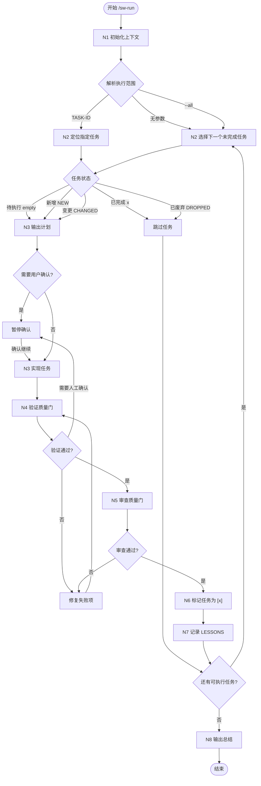

# SweetWave 状态机执行

请求执行范围：

```txt
$ARGUMENTS
```

## 定位

`/sw-run` 是 SweetWave 的可选编排入口。它不替代 `/sw-work`、`/sw-verify`、`/sw-review`，而是把这些分阶段命令串成一个可恢复的任务状态机。

适用场景：

- 用户希望连续执行多个任务。
- 需要从 `TASKS.md` 的状态断点恢复。
- 希望每个任务都强制经过实现、验证、审查、标记完成和经验沉淀。

## 必读输入

读取：

- `CLAUDE.md`
- `.wave/MODULE_MAP.md`
- `.wave/specs/{module}/MODULE.md`
- `.wave/specs/{module}/DESIGN.md`
- `.wave/specs/{module}/ARCH.md`
- `.wave/specs/{module}/SPEC.md`
- `.wave/specs/{module}/TASKS.md`
- `.wave/specs/{module}/TEST_REPORT.md`，如果存在
- `.wave/LESSONS.md`，如果存在

## 状态标记

`TASKS.md` 是任务状态源。必须识别以下状态：

```md
- [ ] 待执行
- [x] 已完成
- [NEW] 新增任务
- [CHANGED] 变更后的任务
- [DROPPED] 已废弃任务
```

处理规则：

- `[x]`：跳过。
- `[DROPPED]`：跳过。
- `[CHANGED]`：按当前任务描述执行。
- `[NEW]`：按新增任务执行。
- `[ ]`：正常执行。

## 状态机



## 工作流程

1. 解析执行范围：
   - 无参数：执行所有模块中的下一个未完成任务。
   - `{module}`：执行指定模块中的下一个未完成任务。
   - `{module} TASK-ID`：只执行指定模块的指定任务。
   - `TASK-ID`：遍历 `.wave/specs/*/TASKS.md` 查找唯一匹配任务。
   - `--all`：按依赖顺序连续执行所有模块的所有未完成任务。
   - `{module} --all`：按依赖顺序连续执行指定模块的所有未完成任务。
2. 读取 `.wave/specs/{module}/TASKS.md`，跳过已完成或废弃任务。
3. 分析依赖关系：
   - 有显式依赖、同文件或同模块改动，串行执行。
   - 无依赖且修改范围隔离，可建议并行，但默认仍以串行为主，除非用户明确授权并行。
4. 对每个任务执行等价于 `/sw-work TASK-ID` 的流程：
   - 定位任务。
   - 提取目标、允许修改范围、禁止修改范围、验收标准、验证命令。
   - 先输出实现计划。
   - 获得用户批准或已有明确授权后再编辑文件。
5. 验证质量门：
   - 执行任务内列出的验证命令。
   - 选择最小相关的 typecheck / lint / test / build。
   - 更新 `.wave/specs/{module}/TEST_REPORT.md`。
   - 失败则修复后重跑；如需要大范围改动，暂停确认。
6. 审查质量门：
   - 审查当前任务相关 diff。
   - 检查 correctness、架构边界、测试缺口、安全风险、无关改动。
   - Must Fix 未解决前不得标记完成。
7. 标记完成：
   - 用 Edit / MultiEdit 将当前任务状态改为 `[x]`。
   - 只修改任务状态，不重写任务描述。
   - 修改后重新读取 `TASKS.md`，确认状态已写入。
8. 记录长期记忆：
   - 如有架构决策、踩坑、跨任务影响、环境特殊处理，追加到 `.wave/LESSONS.md`。
   - 不记录常规开发流水账。
9. 输出进度：
   - 当前任务结果。
   - 验证结果。
   - 审查结果。
   - 已完成 / 总任务数。
   - 下一步建议。

## 暂停规则

必须暂停并询问用户：

- 业务逻辑矛盾或关键规则不明确。
- 涉及权限、支付、隐私、安全、数据删除等高风险行为。
- 需要破坏性变更。
- 需要新增依赖但任务未授权。
- 验证失败需要明显扩大修改范围。

不必暂停：

- 纯技术实现细节有多个合理方案时，选择最符合现有项目约定的方案。
- 小范围重构是完成当前任务的必要条件。
- 修复当前任务引入的局部类型、lint 或测试失败。

## 规则

- 保留 SweetWave 分阶段命令；`/sw-run` 只是编排器。
- 默认串行执行，避免自动并行造成范围失控。
- 每次只推进明确的任务范围。
- 不要跳过验证质量门。
- 不要跳过审查质量门。
- 没有写入 `[x]`，不要声称任务完成。
- 只使用 `.wave/*` 作为 SweetWave 工作区。
- 输出语言使用中文。
